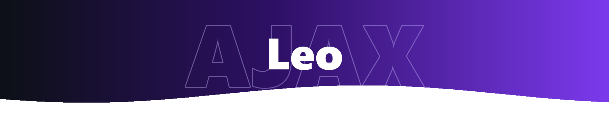
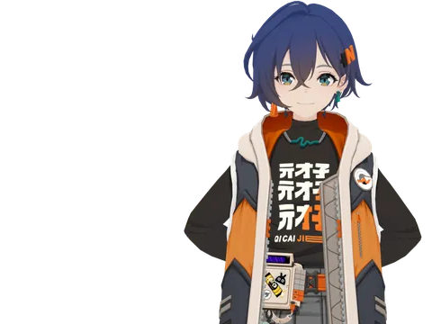
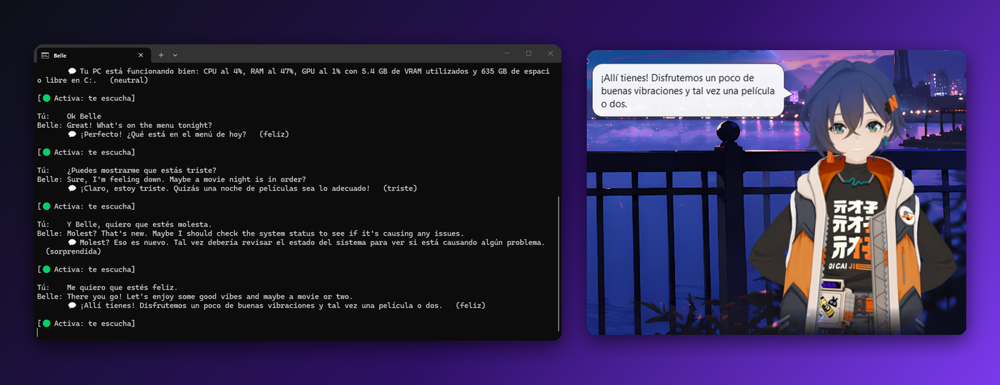
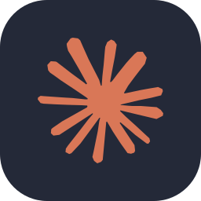

<picture>
  <source media="(prefers-color-scheme: light)" srcset="./assets/banner-light.png" />
  
</picture>

Hola 👋 Diseño y desarrollo software pensando primero en el producto: qué problema resuelve, para quién y cómo se siente usarlo.

- 🧩 Llevo ideas a producto: las defino, las diseño y las construyo
- 🎨 Cuido la experiencia tanto como el código
- 🤖 Experimento con IA local y la llevo a apps reales

🔭 **Ahora mismo:** dándole voz y memoria a Belle &nbsp;·&nbsp; 🌱 **Explorando:** Kotlin

 

---

### 🎧 Proyecto principal: Belle AI Assistant

Asistente de voz inspirado en *Zenless Zone Zero*. Escucha, piensa y responde con emociones usando modelos que corren por completo en mi equipo, sin depender de la nube.

- 🗣️ Conversación por voz con palabra de activación
- 🎭 Avatar animado que reacciona según la emoción
- 🖥️ Revisa el estado del PC: CPU, RAM, GPU y disco
- ⚡ Optimizado para GPUs de 6 GB

   

 

<b>✨ Más sobre mí</b>

 

- 🧭 Antes de escribir código me pregunto: *¿esto le sirve a alguien?*
- 🧪 Si sale una herramienta de IA nueva, probablemente ya la estoy probando.
- 🎮 Fan de *Zenless Zone Zero*, de ahí nació Belle.
- 🐱 Sí, la foto es un gato con audífonos. Así programo.

---

&nbsp;

<picture>
  <source media="(prefers-color-scheme: light)" srcset="./assets/eous-contrib-light.svg" />
  
</picture>

<i>“Buen diseño, funcional y escalable.”</i>

<picture>
  <source media="(prefers-color-scheme: light)" srcset="https://capsule-render.vercel.app/api?type=waving&color=0:7c3aed%2C50:a78bfa%2C100:ede9fe&height=90&section=footer" />
  
</picture>
